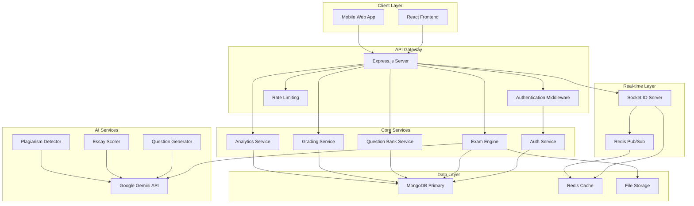

# Design Document

## Overview

The Online Examination & Gamified Quiz Platform is designed as a modern, scalable web application using a microservices-inspired architecture. The system provides secure examination capabilities, real-time multiplayer features, AI-powered content generation, and comprehensive analytics. The platform is built to handle high concurrent usage while maintaining exam integrity and providing an engaging user experience.

## Architecture

### High-Level Architecture



### Technology Stack

**Frontend:**
- React 18 with TypeScript
- Material-UI (MUI) for components
- Redux Toolkit + RTK Query for state management
- React Router for navigation
- Socket.IO client for real-time features

**Backend:**
- Node.js with Express.js
- TypeScript for type safety
- MongoDB with Mongoose ODM
- Redis for caching and sessions
- Socket.IO for real-time communication
- JWT for authentication

**AI & External Services:**
- Google Gemini API for AI features
- Web Speech API for voice recognition
- Nodemailer for email services

**DevOps & Monitoring:**
- Winston for logging
- Helmet for security headers
- Express Rate Limit for API protection
- Swagger for API documentation

## Components and Interfaces

### Core Components

#### 1. Authentication System
```typescript
interface AuthService {
  register(userData: RegisterData): Promise<AuthResponse>
  login(credentials: LoginData): Promise<AuthResponse>
  refreshToken(token: string): Promise<TokenResponse>
  logout(userId: string): Promise<void>
  verifyEmail(token: string): Promise<void>
  resetPassword(email: string): Promise<void>
  enable2FA(userId: string): Promise<TwoFactorSetup>
  verify2FA(userId: string, code: string): Promise<boolean>
}
```

#### 2. Exam Engine
```typescript
interface ExamEngine {
  createExam(examData: ExamConfiguration): Promise<Exam>
  startExamSession(examId: string, userId: string): Promise<ExamSession>
  submitAnswer(sessionId: string, answer: AnswerData): Promise<SubmissionResult>
  getNextQuestion(sessionId: string): Promise<Question>
  finishExam(sessionId: string): Promise<ExamResult>
  pauseExam(sessionId: string): Promise<void>
  resumeExam(sessionId: string): Promise<ExamSession>
}
```

#### 3. Question Bank Management
```typescript
interface QuestionBankService {
  createQuestion(questionData: QuestionData): Promise<Question>
  updateQuestion(questionId: string, updates: Partial<QuestionData>): Promise<Question>
  deleteQuestion(questionId: string): Promise<void>
  getQuestionsByFilters(filters: QuestionFilters): Promise<Question[]>
  importQuestions(file: File): Promise<ImportResult>
  exportQuestions(filters: QuestionFilters): Promise<ExportData>
  generateAIQuestions(topic: string, count: number): Promise<Question[]>
}
```

#### 4. Real-time Multiplayer System
```typescript
interface MultiplayerService {
  createBattle(battleConfig: BattleConfiguration): Promise<Battle>
  joinBattle(battleId: string, userId: string): Promise<BattleSession>
  submitBattleAnswer(sessionId: string, answer: AnswerData): Promise<void>
  getBattleLeaderboard(battleId: string): Promise<LeaderboardEntry[]>
  endBattle(battleId: string): Promise<BattleResult>
}
```

#### 5. Grading and Analytics
```typescript
interface GradingService {
  gradeObjectiveAnswer(answer: ObjectiveAnswer): Promise<GradingResult>
  gradeEssayAnswer(answer: EssayAnswer): Promise<EssayGradingResult>
  calculateExamScore(sessionId: string): Promise<ExamScore>
  generatePerformanceReport(userId: string, timeRange: DateRange): Promise<PerformanceReport>
  detectPlagiarism(text: string, referenceTexts: string[]): Promise<PlagiarismResult>
}
```

### API Endpoints Structure

#### Authentication Endpoints
```
POST /api/auth/register
POST /api/auth/login
POST /api/auth/refresh
POST /api/auth/logout
POST /api/auth/verify-email
POST /api/auth/forgot-password
POST /api/auth/reset-password
POST /api/auth/enable-2fa
POST /api/auth/verify-2fa
```

#### Exam Management Endpoints
```
GET /api/exams
POST /api/exams
GET /api/exams/:id
PUT /api/exams/:id
DELETE /api/exams/:id
POST /api/exams/:id/start
POST /api/exams/sessions/:sessionId/submit
GET /api/exams/sessions/:sessionId/question
POST /api/exams/sessions/:sessionId/finish
```

#### Question Bank Endpoints
```
GET /api/questions
POST /api/questions
GET /api/questions/:id
PUT /api/questions/:id
DELETE /api/questions/:id
POST /api/questions/import
GET /api/questions/export
POST /api/questions/generate-ai
```

#### Multiplayer Endpoints
```
POST /api/battles
GET /api/battles/:id
POST /api/battles/:id/join
GET /api/battles/:id/leaderboard
POST /api/battles/:id/end
```

#### Analytics Endpoints
```
GET /api/analytics/performance/:userId
GET /api/analytics/leaderboard
GET /api/analytics/exam-stats/:examId
GET /api/analytics/reports
POST /api/analytics/reports/generate
```

## Data Models

### User Model
```typescript
interface User {
  _id: ObjectId
  firstName: string
  lastName: string
  email: string
  password: string // hashed
  role: 'student' | 'educator' | 'admin'
  avatar?: string
  isEmailVerified: boolean
  
  // Gamification
  gamification: {
    level: number
    xp: number
    totalXP: number
    streak: {
      current: number
      longest: number
      lastActivity: Date
    }
    achievements: ObjectId[]
    badges: Badge[]
  }
  
  // Statistics
  statistics: {
    totalExamsTaken: number
    totalQuestionsAnswered: number
    totalStudyTime: number
    averageScore: number
    subjectWiseStats: SubjectStats[]
  }
  
  // Settings
  settings: UserSettings
  
  createdAt: Date
  updatedAt: Date
}
```

### Exam Model
```typescript
interface Exam {
  _id: ObjectId
  title: string
  description: string
  type: 'GATE' | 'GRE' | 'TOEFL' | 'CUSTOM'
  category: string
  subject?: string
  
  // Configuration
  duration: number // minutes
  totalQuestions: number
  passingScore: number
  maxAttempts: number
  
  // Question settings
  questionTypes: QuestionType[]
  difficultyDistribution: {
    easy: number
    medium: number
    hard: number
  }
  
  // Sections for structured exams
  sections: ExamSection[]
  
  // Question pool
  questions: ObjectId[]
  
  // Scheduling 
  isScheduled: boolean
  scheduledStart?: Date
  scheduledEnd?: Date
  
  // Access control
  isPublic: boolean
  allowedUsers: ObjectId[]
  
  // Settings
  settings: ExamSettings
  
  createdBy: ObjectId
  createdAt: Date
  updatedAt: Date
}
```

### Question Model
```typescript
interface Question {
  _id: ObjectId
  type: 'mcq' | 'numerical' | 'essay' | 'listening' | 'speaking' | 'reading'
  subject: string
  topic: string
  difficulty: 'easy' | 'medium' | 'hard'
  
  // Question content
  question: string
  options?: string[] // for MCQ
  correctAnswer: string | number
  explanation?: string
  
  // Media attachments
  attachments: {
    type: 'image' | 'audio' | 'video'
    url: string
    description?: string
  }[]
  
  // Metadata
  tags: string[]
  estimatedTime: number // seconds
  points: number
  
  // Analytics
  statistics: {
    timesUsed: number
    averageTime: number
    correctPercentage: number
    lastUsed: Date
  }
  
  // AI generated flag
  isAIGenerated: boolean
  aiPrompt?: string
  
  createdBy: ObjectId
  createdAt: Date
  updatedAt: Date
}
```

### ExamSession Model
```typescript
interface ExamSession {
  _id: ObjectId
  examId: ObjectId
  userId: ObjectId
  
  // Session state
  status: 'active' | 'paused' | 'completed' | 'expired'
  startTime: Date
  endTime?: Date
  duration: number // actual duration in minutes
  
  // Questions and answers
  questions: ObjectId[]
  currentQuestionIndex: number
  answers: {
    questionId: ObjectId
    answer: string | number
    timeSpent: number
    submittedAt: Date
    isCorrect?: boolean
    points?: number
  }[]
  
  // Scoring
  score: {
    total: number
    percentage: number
    sectionWise?: SectionScore[]
  }
  
  // Proctoring data
  violations: {
    type: string
    timestamp: Date
    severity: 'low' | 'medium' | 'high'
    description: string
  }[]
  
  // Metadata
  ipAddress: string
  userAgent: string
  
  createdAt: Date
  updatedAt: Date
}
```

### Battle Model (Multiplayer)
```typescript
interface Battle {
  _id: ObjectId
  title: string
  type: '1v1' | 'team' | 'tournament'
  mode: 'speed' | 'accuracy' | 'mixed'
  
  // Configuration
  questionCount: number
  timeLimit: number
  subject: string
  difficulty: 'easy' | 'medium' | 'hard' | 'mixed'
  
  // Participants
  participants: {
    userId: ObjectId
    joinedAt: Date
    score?: number
    rank?: number
  }[]
  
  // Questions
  questions: ObjectId[]
  
  // State
  status: 'waiting' | 'active' | 'completed'
  startTime?: Date
  endTime?: Date
  
  // Results
  winner?: ObjectId
  leaderboard: LeaderboardEntry[]
  
  createdBy: ObjectId
  createdAt: Date
  updatedAt: Date
}
```

## Error Handling

### Error Response Format
```typescript
interface ErrorResponse {
  success: false
  error: {
    code: string
    message: string
    details?: any
    timestamp: string
    requestId: string
  }
}
```

### Error Categories
1. **Authentication Errors** (401, 403)
2. **Validation Errors** (400)
3. **Not Found Errors** (404)
4. **Rate Limit Errors** (429)
5. **Server Errors** (500)
6. **External Service Errors** (502, 503)

### Error Handling Strategy
- Centralized error handling middleware
- Structured error logging with Winston
- User-friendly error messages
- Automatic retry for transient failures
- Circuit breaker pattern for external services

## Testing Strategy

### Unit Testing
- Jest for JavaScript/TypeScript testing
- React Testing Library for component testing
- Mongoose mocking for database operations
- 90%+ code coverage target

### Integration Testing
- API endpoint testing with Supertest
- Database integration testing
- Socket.IO event testing
- External service mocking

### End-to-End Testing
- Cypress for full user journey testing
- Exam taking flow testing
- Multiplayer battle testing
- Cross-browser compatibility testing

### Performance Testing
- Load testing with Artillery
- Database query optimization testing
- Real-time feature stress testing
- Mobile performance testing

### Security Testing
- Authentication flow testing
- Authorization testing
- Input validation testing
- SQL injection prevention testing
- XSS prevention testing

## Security Considerations

### Authentication & Authorization
- JWT tokens with short expiration
- Refresh token rotation
- Role-based access control (RBAC)
- Two-factor authentication (2FA)
- OAuth2 integration

### Data Protection
- AES-256 encryption for sensitive data
- HTTPS only communication
- Secure cookie configuration
- Password hashing with bcrypt
- Input sanitization and validation

### Exam Security
- Browser lockdown simulation
- Session monitoring
- Plagiarism detection
- Time-based session validation
- IP address tracking

### API Security
- Rate limiting per user/IP
- Request size limits
- CORS configuration
- Security headers (Helmet.js)
- API key management

## Performance Optimization

### Frontend Optimization
- Code splitting and lazy loading
- Image optimization and lazy loading
- Bundle size optimization
- Service worker for caching
- Progressive Web App (PWA) features

### Backend Optimization
- Database query optimization
- Redis caching strategy
- Connection pooling
- Compression middleware
- CDN for static assets

### Real-time Optimization
- Socket.IO connection management
- Event batching and throttling
- Room-based broadcasting
- Connection cleanup

### Database Optimization
- Proper indexing strategy
- Query optimization
- Connection pooling
- Read replicas for analytics
- Data archiving strategy

## Monitoring and Logging

### Application Monitoring
- Winston for structured logging
- Performance metrics collection
- Error tracking and alerting
- Uptime monitoring
- Resource usage monitoring

### Business Metrics
- User engagement metrics
- Exam completion rates
- Question difficulty analysis
- Performance trends
- Revenue metrics (if applicable)

### Security Monitoring
- Failed login attempts
- Suspicious activity detection
- Data access logging
- Compliance audit trails
- Vulnerability scanning

## Deployment Architecture

### Development Environment
- Local MongoDB and Redis instances
- Hot reloading for development
- Mock external services
- Comprehensive logging

### Staging Environment
- Production-like configuration
- Full integration testing
- Performance testing
- Security testing

### Production Environment
- Load balancer configuration
- Auto-scaling setup
- Database clustering
- CDN configuration
- Backup and disaster recovery

### CI/CD Pipeline
- Automated testing on commits
- Code quality checks
- Security scanning
- Automated deployment
- Rollback capabilities